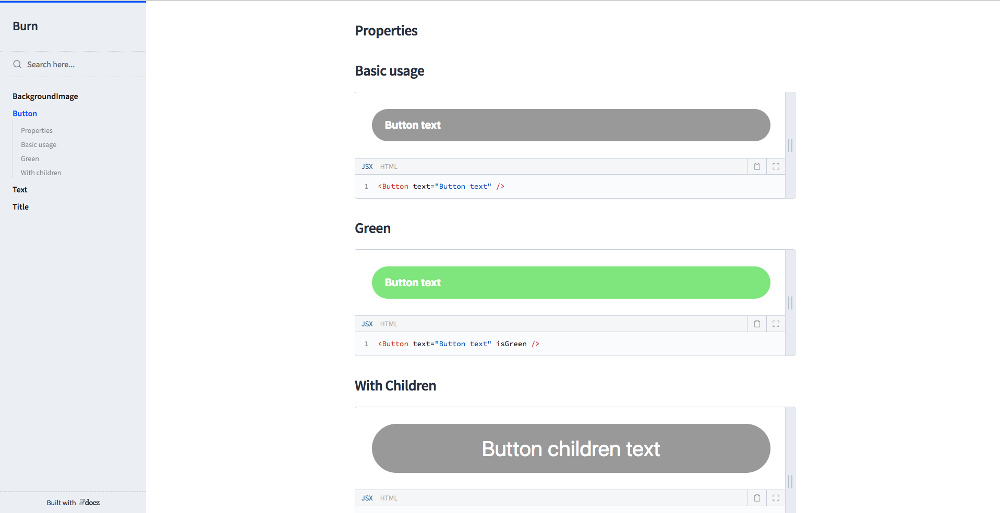

# BURN


A

- Redux
- Redux-Thunk
- React-Navigation
- Animatable
- Jest(Unit tests)
- Flow(Type checking)
- Detox(e2e tests)
- Docz(Styleguide)
- Styled components
- Eslint
- Prettier

React Native boilerplate

## Glossary

- [Overview](#overview)
- [Installation](#installation)
- [Usage](#usage)
  - [Styleguide](#styleguide)
  - [Testing](#testing)
  - [Prettier](#prettier)
  - [Pre-commit hook](#pre-commit)

---

## Overview

Welcome to Burn react-native boilerplate


## Installation

Feel free to fork or clone this project and run

```yarn install```

then

```yarn ios```

And there you go!

## Styleguide

For the project Styleguide we will go for the best option: Docz

### Docz
To run Docz simply:
```yarn docz dev```


## Testing

#### Flow

To run Flow on the project, you can easily use already prepared scripts from `package.json` file and run

```yarn flow```

This starts Flow server and executes Flow checks. To stop Flow server, you can execute:

```yarn flow-stop```

More on Flow you can find [here](https://flow.org/en/docs/).

#### ESLint

To check styling and other ESLint rules defined in `.eslintrc` file, it's enough to run:

```yarn lint```

#### Jest Unit tests

There is a script prepared to run all the unit tests defined with the use of Jest. Just run:

```yarn test:unit```

#### Detox e2e tests

There is a script prepared to run all the e2e test which plays the entire game and restarts the app

First you have to build it:
```yarn test:e2e:build```

Now, just run the test:
```yarn test:e2e```

---

### Prettier

[Prettier](https://github.com/prettier/prettier) is formatting all code

```yarn pretty```

---

### Pre-commit

This project comes with already prepared `precommit` hook, that runs prettier on  code and then executes unit tests, just before the commit. This will prevent you from commiting badly styled or invalid code to the repo.

Precommit is defined in `package.json`'s `scripts` section and is taking advantage of a package called `lint-staged`. You can find more info on it [here](https://github.com/okonet/lint-staged).

